Claro. Aqui está um relatório em **Markdown (`.md`)** sobre os 8 bugs e as correções realizadas:

# Relatório de Correção de Bugs — Nexus dos Heróis

## 1. Introdução

Durante a análise do sistema **Nexus dos Heróis**, foram identificados 8 bugs que afetavam funcionalidades importantes da aplicação. Os problemas encontrados estavam relacionados principalmente à autenticação, proteção de rotas, validação de formulários, acesso aos dados dos usuários, manipulação de personagens e segurança do banco de dados.

O objetivo das correções foi garantir que o sistema funcionasse corretamente e que os dados dos usuários fossem protegidos contra acessos ou alterações indevidas.

---

## 2. Bugs Identificados e Corrigidos

### BUG 01 — Login Silencia Erros

**Problema:**

Quando o usuário digitava uma senha incorreta ou utilizava um e-mail que não existia, nenhuma mensagem de erro era apresentada. O botão permanecia em `"Entrando..."`, dando a impressão de que o sistema havia travado.

**Causa:**

O bloco `catch` da função `handleSubmit` estava vazio e não tratava o erro retornado pelo Firebase.

**Correção:**

Foi adicionada uma mensagem de erro utilizando `setErro()`:

```tsx
catch {
  setErro("E-mail ou senha inválidos.");
}
```

Além disso, o estado `carregando` continua sendo desativado pelo bloco `finally`.

**Resultado:**

O usuário recebe uma mensagem informando que os dados de login estão incorretos e o botão volta ao estado normal.

**Status:** ✅ Corrigido

---

### BUG 02 — Rota Protegida não Protege

**Problema:**

A proteção da rota estava funcionando de forma invertida. Usuários autenticados poderiam ser enviados para o login, enquanto usuários não autenticados poderiam acessar páginas protegidas.

**Causa:**

A condição utilizada no `middleware.ts` verificava a existência do token:

```tsx
if (token)
```

A lógica correta deveria verificar a **ausência** do token.

**Correção:**

A condição foi alterada para:

```tsx
if (!token)
```

O operador `!` representa uma negação.

**Resultado:**

Usuários sem autenticação são direcionados para `/login`, enquanto usuários autenticados podem acessar as rotas protegidas.

**Status:** ✅ Corrigido

---

### BUG 03 — Confirmação de Senha Quebrada

**Problema:**

O campo `"Confirmar Senha"` não realizava corretamente a validação da senha.

**Causa:**

A validação comparava a senha com a variável incorreta. A lógica esperada é comparar `senha` com `confirmarSenha`.

**Correção:**

Foi utilizada a seguinte condição:

```tsx
if (senha !== confirmarSenha) {
  setErro("As senhas não coincidem.");
  return;
}
```

Também foi mantida a validação para exigir pelo menos 6 caracteres:

```tsx
if (senha.length < 6) {
  setErro("A senha deve ter no mínimo 6 caracteres.");
  return;
}
```

**Resultado:**

O cadastro não pode continuar quando as senhas digitadas são diferentes.

**Status:** ✅ Corrigido

---

### BUG 04 — Personagens de Outros Usuários Aparecem

**Problema:**

O dashboard apresentava personagens pertencentes a outros usuários.

**Causa:**

A função `listarPersonagens()` buscava todos os documentos da coleção `personagens`, sem verificar o proprietário de cada personagem.

**Correção:**

Foi adicionado o filtro `where()`:

```tsx
const q = query(
  collection(db, "personagens"),
  where("userId", "==", _uid)
);
```

Também foi importado:

```tsx
where
```

do Firebase Firestore.

**Resultado:**

Cada usuário passa a visualizar somente os personagens associados ao seu próprio `userId`.

**Status:** ✅ Corrigido

---

### BUG 05 — Personagem Criado, mas não Aparece

**Problema:**

O personagem era criado, mas não aparecia posteriormente no dashboard.

**Causa:**

O sistema utilizava nomes diferentes para a coleção do Firestore.

A criação utilizava:

```tsx
collection(db, "personagem")
```

Enquanto a consulta utilizava:

```tsx
collection(db, "personagens")
```

Essas são duas coleções diferentes no Firestore.

**Correção:**

A coleção utilizada na criação foi alterada para:

```tsx
collection(db, "personagens")
```

A função passou a salvar os dados na mesma coleção utilizada pelo dashboard:

```tsx
const ref = await addDoc(collection(db, "personagens"), {
  nome,
  classe,
  nivel: 1,
  xp: 0,
  userId: uid,
  criadoEm: serverTimestamp(),
});
```

**Resultado:**

Os personagens passam a ser armazenados na coleção correta e podem ser encontrados pelo dashboard.

**Status:** ✅ Corrigido

---

### BUG 06 — Equipar Item Apaga Outros Equipamentos

**Problema:**

Ao equipar um novo item, outros equipamentos ou informações do personagem poderiam desaparecer.

**Causa:**

A função utilizava `setDoc()`:

```tsx
await setDoc(doc(db, "personagens", personagemId), {
  [slot]: itemId
});
```

O `setDoc()` pode substituir o documento existente.

**Correção:**

Foi utilizado `updateDoc()`:

```tsx
await updateDoc(doc(db, "personagens", personagemId), {
  [slot]: itemId,
});
```

**Resultado:**

Somente o equipamento selecionado é atualizado, mantendo os demais dados do personagem.

**Status:** ✅ Corrigido

---

### BUG 07 — Personagem Errado é Deletado

**Problema:**

Ao tentar excluir um personagem, o sistema poderia tentar excluir o personagem errado ou gerar um erro.

**Causa:**

A função utilizava o índice do personagem na lista como se fosse o ID do documento no Firestore:

```tsx
String(indice)
```

O índice pode ser `0`, `1`, `2`, etc., enquanto o Firebase utiliza o ID real do documento.

**Correção:**

Foi utilizado o ID do próprio personagem:

```tsx
await deleteDoc(
  doc(db, "personagens", personagem.id)
);
```

**Resultado:**

O sistema passa a excluir exatamente o personagem selecionado.

**Status:** ✅ Corrigido

---

### BUG 08 — Regras de Segurança do Firestore Abertas

**Problema:**

Qualquer pessoa poderia ler, criar, modificar ou excluir documentos do banco de dados, mesmo sem estar autenticada.

**Causa:**

As regras estavam configuradas desta forma:

```text
match /{document=**} {
  allow read, write: if true;
}
```

A condição `if true` permite todas as operações.

**Correção:**

As regras foram restringidas para exigir autenticação e verificar o proprietário do personagem:

```text
rules_version = '2';

service cloud.firestore {
  match /databases/{database}/documents {

    match /personagens/{personagemId} {
      allow read: if request.auth != null &&
                  request.auth.uid == resource.data.userId;

      allow create: if request.auth != null &&
                    request.auth.uid == request.resource.data.userId;

      allow update, delete: if request.auth != null &&
                            request.auth.uid == resource.data.userId;
    }
  }
}
```

**Resultado:**

Somente usuários autenticados podem acessar os personagens e cada usuário pode manipular apenas os próprios dados.

**Status:** ✅ Corrigido

> **Importante:** as regras precisam ser publicadas no Firebase para que a alteração tenha efeito.

---

## 3. Resumo das Correções

| Bug    | Problema                           | Status      |
| ------ | ---------------------------------- | ----------- |
| BUG 01 | Login não exibia erros             | ✅ Corrigido |
| BUG 02 | Proteção de rota invertida         | ✅ Corrigido |
| BUG 03 | Confirmação de senha incorreta     | ✅ Corrigido |
| BUG 04 | Personagens de outros usuários     | ✅ Corrigido |
| BUG 05 | Personagem salvo na coleção errada | ✅ Corrigido |
| BUG 06 | Equipamentos apagavam outros dados | ✅ Corrigido |
| BUG 07 | Exclusão utilizava ID incorreto    | ✅ Corrigido |
| BUG 08 | Regras do Firestore abertas        | ✅ Corrigido |

**Total:** 8 bugs identificados
**Corrigidos:** 8
**Pendentes:** 0

---

## 4. Testes Recomendados

Após as correções, recomenda-se realizar os seguintes testes:

* [ ] Tentar fazer login com uma senha incorreta.
* [ ] Tentar acessar o dashboard sem estar autenticado.
* [ ] Criar uma conta utilizando senhas diferentes.
* [ ] Criar personagens com dois usuários diferentes.
* [ ] Confirmar que cada usuário visualiza somente seus próprios personagens.
* [ ] Criar um novo personagem e verificar se ele aparece no dashboard.
* [ ] Equipar arma, armadura e anel no mesmo personagem.
* [ ] Excluir diferentes personagens e verificar se o correto é removido.
* [ ] Tentar acessar os dados de outro usuário sem autorização.
* [ ] Publicar e testar as regras de segurança do Firestore.

---

## 5. Conclusão

A correção dos oito bugs melhora significativamente a estabilidade, segurança e confiabilidade do **Nexus dos Heróis**. Os problemas encontrados afetavam desde funcionalidades básicas, como login e criação de personagens, até questões mais críticas relacionadas à proteção de dados e às permissões do Firestore.

As alterações realizadas garantem uma melhor experiência para o usuário, evitando erros silenciosos, garantindo a correta validação dos dados e assegurando que cada usuário tenha acesso somente aos seus próprios personagens.

Além das correções funcionais, a implementação de regras de segurança no Firestore representa uma melhoria essencial para proteger os dados armazenados no sistema contra acessos não autorizados.

## 6. Imagens de errors
## Error 1
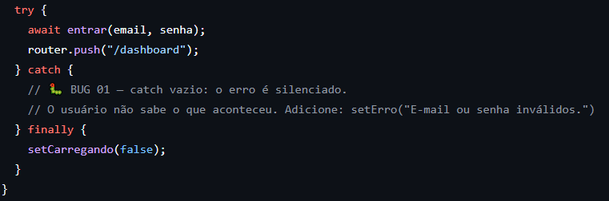
## Error 2
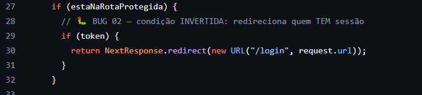
## Error 3
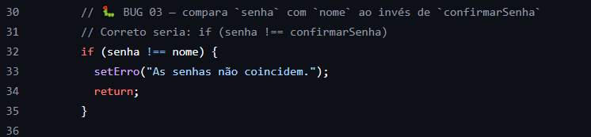
## Error 4
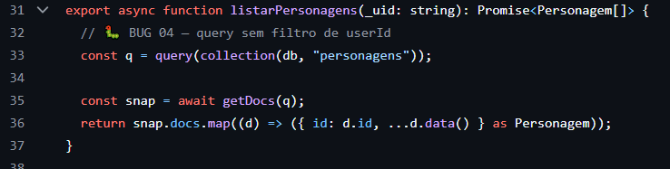
## Error 5
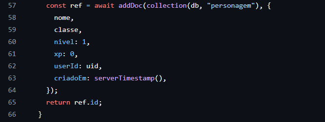
## Error 6
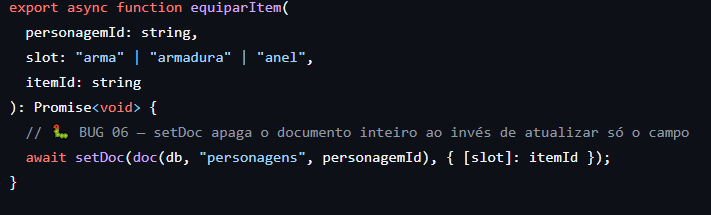
## Error 7
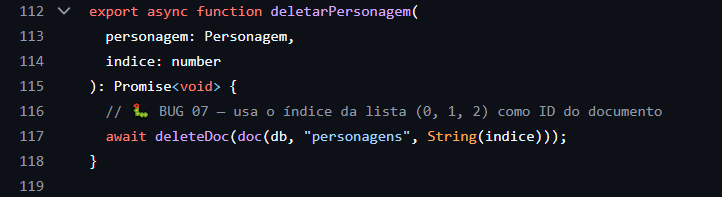
## Error 8
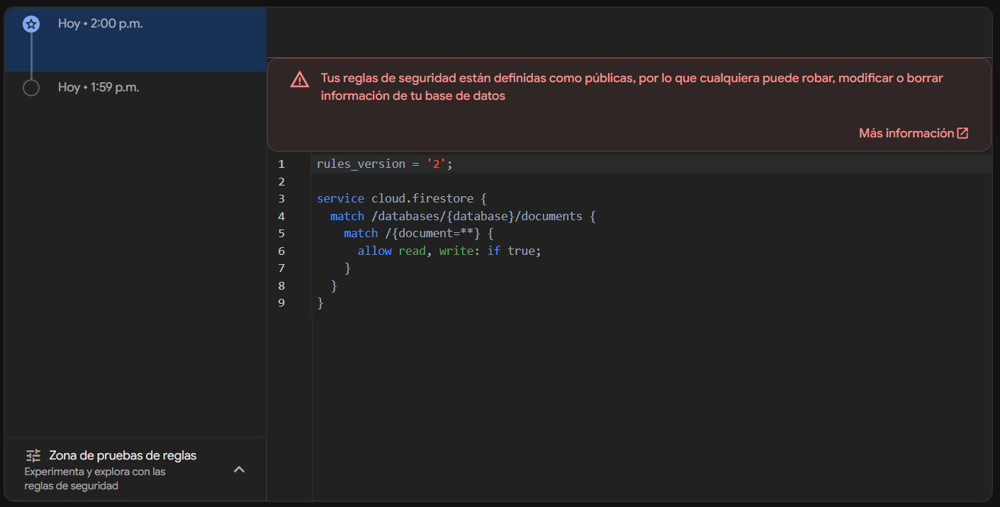
## Solução 1
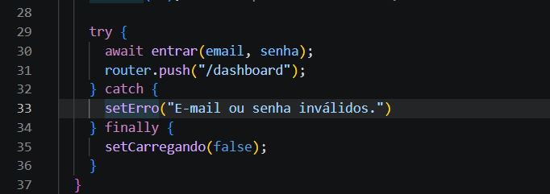
## Solução 2
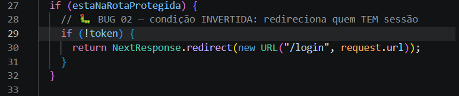
## Solução 3
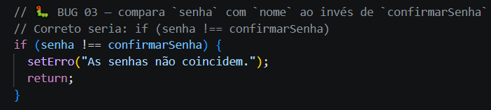
## Solução 4
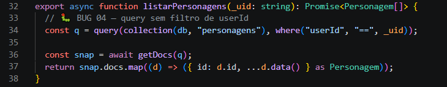
## Solução 5
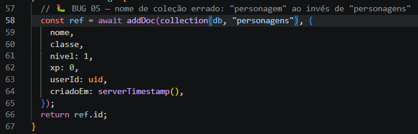
## Solução 6
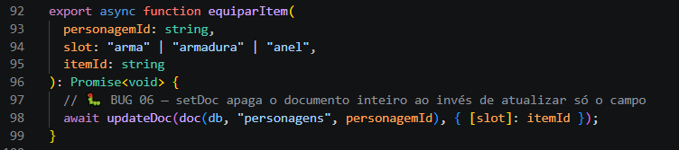
## Solução 7
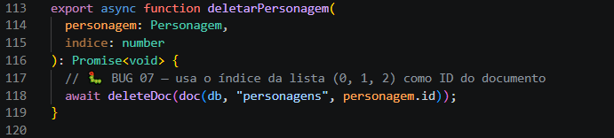
## Solução 8
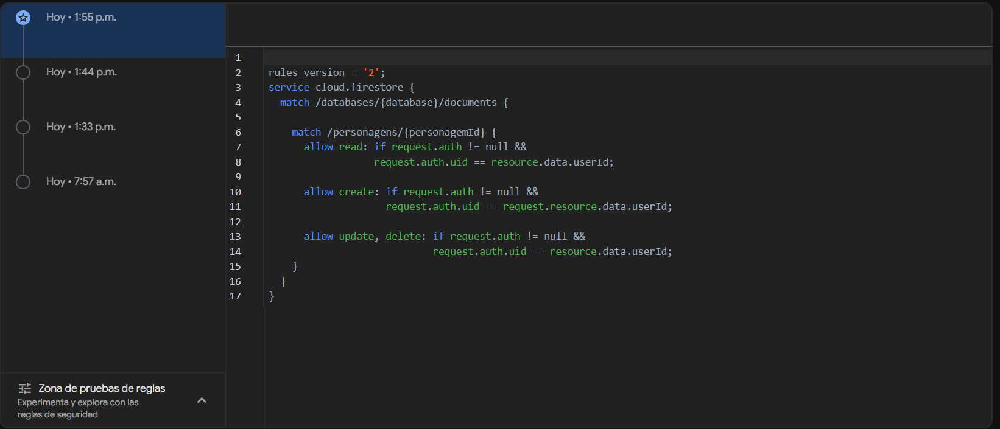